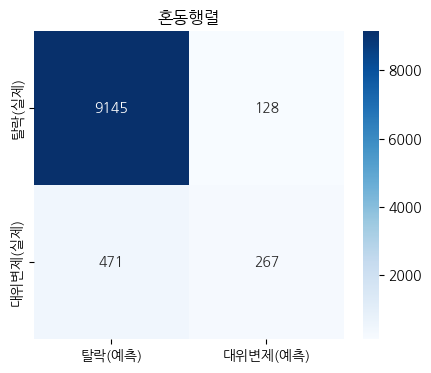
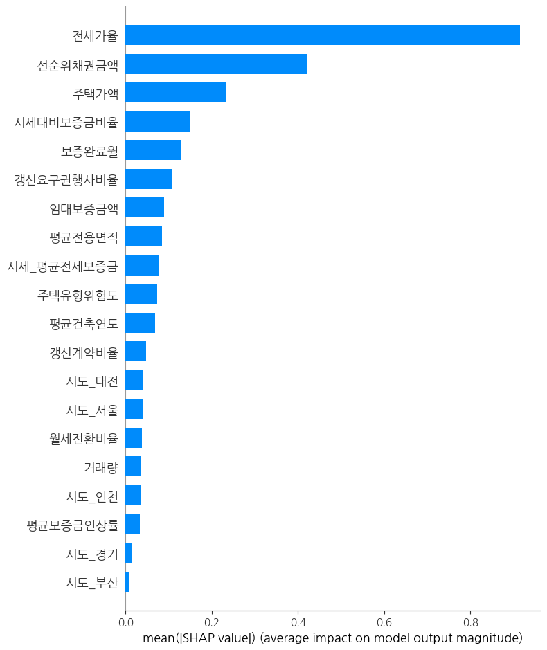
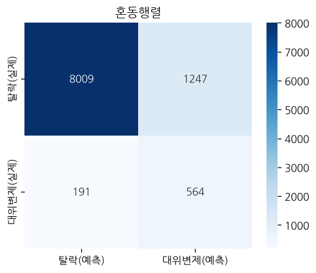
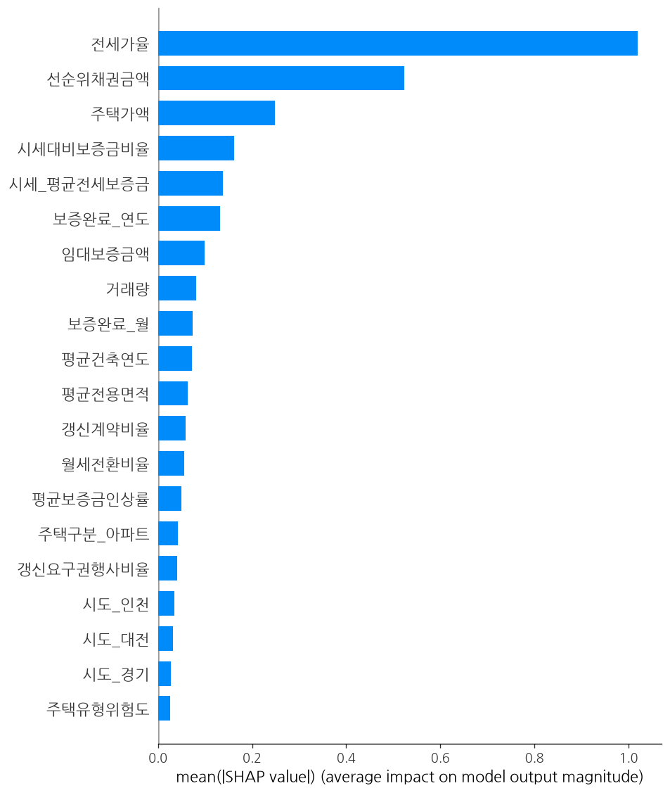
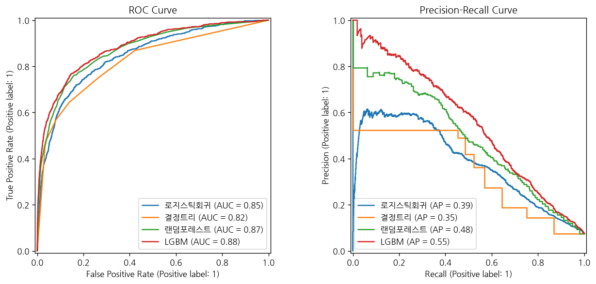

# 깡통전세(대위변제) 예측 모델링 결과 리포트

업로드된 노트북(`최종_전세보증대위변제현황_피처완료.xlsx` 기반, 19컬럼 50,054행)을 실행한 결과를
정리한 리포트. 로지스틱회귀/결정트리/랜덤포레스트/LGBM 4개 모델을 비교하고, 최종 모델(LGBM)을
SHAP으로 해석하는 것까지가 노트북의 목표다.

---

## 1. 데이터 개요

| 항목 | 내용 |
| --- | --- |
| 원본 크기 | 50,054행 × 19컬럼 |
| 타겟 | `대위변제여부` (0=정상, 1=대위변제 발생) |
| 대위변제 비율 | **7.5%** — 뚜렷한 클래스 불균형 (정상:대위변제 ≈ 12:1) |
| 결측치 | 전 컬럼 0건 (이미 처리된 최종 데이터셋) |

포함된 피처는 크게 4개 그룹이다.
- **기본 계약정보**: 보증완료월, 주택가액, 임대보증금액, 선순위채권금액, 전세가율, 주택유형위험도
- **시세 비교 피처**: 시세_평균전세보증금, 시세대비보증금비율, 월세전환비율
- **갱신계약 피처**: 평균보증금인상률, 갱신계약비율, 갱신요구권행사비율
- **건물 특성 피처**: 평균건축연도, 평균전용면적, 거래량
- 범주형(시도, 주택구분)은 원-핫 인코딩으로 처리

## 2. 전처리 과정

1. **결측치 확인** — 전 컬럼 0건이라 별도 처리 없이 통과
2. **불필요한 컬럼 제거** — `일련번호`(식별자, 예측에 무의미) 제거
3. **원-핫 인코딩** — `시도`, `주택구분`을 `drop_first=True`로 더미화 → 컬럼 수 19 → 39개로 증가
4. **날짜 → 숫자 변환** — `보증완료월`(datetime)을 `toordinal()`로 정수화 (예: 2024-01-01 → 738886).
   모델이 날짜를 직접 다룰 수 없어서 순서가 있는 숫자로 바꾼 것

전처리 후 최종 피처 수는 **38개** (타겟 `대위변제여부` 제외), Train 40,043행 / Test 10,011행 (8:2 분할).

## 3. 클래스 불균형 확인

```
대위변제 비율: 0.075 (7.5%)
```
정상 계약이 92.5%, 대위변제가 7.5%인 불균형 데이터다. 이런 데이터에서는 **정확도(Accuracy)만으로
모델을 평가하면 안 된다** — "전부 정상이라고만 찍어도" 정확도가 92.5%가 나오기 때문이다. 그래서
이 노트북은 **F1 점수**(정밀도와 재현율의 조화평균)를 주 평가지표로 사용했다.

## 4. 교차검증 (StratifiedKFold)

5-Fold 교차검증(각 fold마다 대위변제 비율을 동일하게 유지) 결과:

```
5번의 F1 점수: [0.510  0.497  0.478  0.491  0.486]
평균 F1: 0.492
```

fold별 F1이 0.478~0.510 사이로 **편차가 크지 않다** — 데이터를 어떻게 나누든 모델 성능이
안정적이라는 뜻이며, 이후 단일 train/test 분할로 모델을 비교해도 결과를 신뢰할 수 있다는 근거가 된다.

## 5. 모델 비교

4개 분류 모델을 학습해서 테스트셋 F1로 비교했다.

| 모델 | F1 점수 | 비고 |
| --- | --- | --- |
| **LGBM** | **0.471** | 최고 성능, 최종 채택 |
| 랜덤포레스트 | 0.436 | LGBM 대비 소폭 낮음 |
| 결정트리 (depth=3) | 0.357 | 단순 모델, 성능 한계 명확 |
| 로지스틱회귀 | 0.005 | **사실상 예측 실패** |

**로지스틱회귀가 0.005로 극단적으로 낮은 이유**: 로지스틱회귀는 선형 결정경계를 쓰기 때문에
피처 간 비선형 상호작용(예: "전세가율이 높으면서 동시에 갱신요구권행사비율이 낮은 경우"처럼
조건부 패턴)을 못 잡는다. 게다가 클래스 불균형(7.5%) 상황에서 별도 조정(`class_weight` 등) 없이
학습하면 다수 클래스(정상)만 예측하는 방향으로 수렴하기 쉽다 — 그 결과가 F1 0.005다.

**트리 계열(결정트리→랜덤포레스트→LGBM)로 갈수록 성능이 오르는 것**은 예상된 패턴이다. 단일
트리(depth 제한 3)는 표현력이 부족하고, 랜덤포레스트는 여러 트리의 평균으로 분산을 줄이며, LGBM은
그래디언트 부스팅으로 이전 트리의 오차를 순차적으로 보정하기 때문에 일반적으로 가장 좋은 성능을 낸다.

## 6. 최종 모델(LGBM) 성능 평가

```
정확도(Accuracy): 0.940
F1 점수: 0.471
```

### 혼동행렬(Confusion Matrix)



| | 탈락(예측) | 대위변제(예측) |
| --- | --- | --- |
| **탈락(실제)** | 9,145 (TN) | 128 (FP) |
| **대위변제(실제)** | 471 (FN) | 267 (TP) |

혼동행렬에서 계산한 세부 지표:
- **정밀도(Precision)** = 267 / (267+128) = **67.6%** — "대위변제"라고 예측했을 때 실제로 맞을 확률
- **재현율(Recall)** = 267 / (267+471) = **36.2%** — 실제 대위변제 738건 중 모델이 찾아낸 비율

**해석**: 정확도는 94%로 높아 보이지만, 이는 클래스 불균형 때문에 부풀려진 숫자다(정상만 찍어도
92.5%). 진짜 중요한 건 재현율 36.2%인데, **실제 대위변제 사고 738건 중 471건(64%)을 놓치고
267건만 잡아냈다**는 뜻이다. 반대로 정밀도는 67.6%로, 모델이 "위험하다"고 경고한 395건 중
실제로 사고가 난 건 267건(나머지 128건은 오탐)이다. 즉 이 모델은 **"놓치는 사고가 여전히
많은"(재현율이 낮은) 상태**이며, 전세사기 조기경보처럼 재현율이 중요한 용도로 쓰려면 임계값 조정이나
클래스 가중치 부여 등 추가 튜닝이 필요하다.

## 7. SHAP으로 모델 해석하기

`TreeExplainer`로 LGBM의 예측 근거를 뜯어봤다.

### 7-1. Force Plot — 개별 매물 1건 해석 (Local)

노트북에서는 Train 데이터 첫 번째 매물(인덱스 43185, 인천·아파트)의 예측 근거를 SHAP 값으로
분해했다. Force plot 자체는 인터랙티브 HTML이라 리포트에 이미지로 못 옮기지만, 노트북에 출력된
숫자 기여도로 같은 내용을 확인할 수 있다.

**이 매물 정보(요약)**: 주택가액 9.25억, 임대보증금액 4억, 선순위채권금액 3.1억, 전세가율 0.43,
시세대비보증금비율 1.52(시세보다 52% 비쌈), 갱신요구권행사비율 0.36, 인천·아파트

**SHAP 기여도 상위 항목** (양수 = 대위변제 위험을 높이는 방향, 음수 = 낮추는 방향):

| 변수 | SHAP 값 | 방향 |
| --- | --- | --- |
| 선순위채권금액 | **+2.186** | 위험 ↑ (가장 큰 영향) |
| 전세가율 | −0.876 | 위험 ↓ |
| 주택가액 | −0.893 | 위험 ↓ |
| 평균보증금인상률 | +0.305 | 위험 ↑ |
| 거래량 | +0.230 | 위험 ↑ |
| 월세전환비율 | +0.248 | 위험 ↑ |
| 보증완료월 | +0.065 | 위험 ↑ (미미) |
| 시도_인천 | +0.057 | 위험 ↑ (미미) |

이 한 건에서는 **선순위채권금액이 압도적으로 큰 위험 신호**로 작용했다(+2.186, 다른 변수보다
한 자릿수 큼) — 이미 다른 채권자가 3.1억을 먼저 가져갈 권리가 있어서, 세입자 보증금이 후순위로
밀릴 위험이 크다는 뜻으로 해석된다. 반면 전세가율(0.43, 낮은 편)과 주택가액(9.25억, 고가 주택)은
오히려 위험을 낮추는 방향으로 작용했다 — 집값 대비 보증금 비중이 낮아 설사 경매로 넘어가도
회수 여력이 있다는 신호로 모델이 학습한 것으로 보인다.

### 7-2. Summary Plot (Bar) — 전체 변수 중요도 (Global)



전체 Train 데이터(40,043건)에 대해 각 변수의 평균 절대 SHAP 값(`mean(|SHAP value|)`)을 막대
그래프로 나타낸 것으로, 개별 사례가 아니라 **모델 전체가 어떤 변수를 가장 많이 참고하는지** 보여준다.

**중요도 순위 (상위 6개)**:
1. **전세가율** — 압도적 1위(약 0.9). 보증금/주택가액 비율이 높을수록(즉 깡통전세에 가까울수록)
   예측에 가장 큰 영향을 준다는 뜻으로, 도메인 상식과 정확히 일치한다.
2. **선순위채권금액** — 2위(약 0.42). 앞선 개별 사례에서도 확인했듯, 다른 채권자가 얼마나
   먼저 가져가는지가 위험도 핵심 신호다.
3. **주택가액** — 3위(약 0.23)
4. **시세대비보증금비율** — 4위. 이번에 새로 추가한 시세 비교 피처가 상위권에 들었다 —
   "시세보다 비싸게 낸 전세"가 실제로 유의미한 신호임을 모델이 확인해준 것
5. **보증완료월** — 5위. 시간 흐름(계약 시기)도 어느 정도 영향
6. **갱신요구권행사비율** — 6위. 이번에 추가한 갱신계약 피처 중에는 이게 가장 중요도가 높다

**하위권**: 갱신계약비율·평균보증금인상률·시도 더미변수 대부분은 중요도가 낮다. 이는 앞서
`REPORT.md`(갱신피처 문서)에서 확인했던 "대위변제여부와의 단순 상관관계가 약하다(0.01~0.06)"는
결과와 일치한다 — 갱신계약 관련 피처들은 보조적인 신호일 뿐, 모델이 크게 의존하지는 않는다.

## 8. 종합 정리

- **모델 선택**: LGBM이 F1 0.471로 4개 모델 중 최고 성능. 다만 재현율(36.2%)이 낮아 실제
  대위변제의 상당수를 놓치고 있어 실무 적용 전 추가 개선이 필요하다.
- **가장 중요한 피처**: 전세가율 > 선순위채권금액 > 주택가액 > 시세대비보증금비율 > 보증완료월
  > 갱신요구권행사비율 순. 새로 추가한 "시세 비교" 피처군은 상위권에 들어 유의미했고, "갱신계약"
  피처군은 보조적 수준의 기여도를 보였다.
- **개선 방향**:
  - 클래스 불균형 대응: `class_weight='balanced'`, SMOTE 오버샘플링, 또는 예측 임계값(threshold)
    조정으로 재현율 향상 시도
  - 로지스틱회귀는 이 데이터에 적합하지 않음이 확인됨 — 비선형 트리 계열 모델 위주로 개발 지속
  - SHAP 상위 피처(전세가율, 선순위채권금액, 시세대비보증금비율) 중심으로 피처 엔지니어링 고도화

---

## 9. 피드백 반영 (stratify / 스케일링 / 클래스 불균형 / 날짜 피처)

리뷰 피드백 3가지 + 보완사항 2가지를 반영해서 노트북을 수정했다
(`전세대출_대위변제예측_모델링_수정본.ipynb`).

### 9-1. 반영한 피드백

| 피드백 | 문제였던 점 | 수정 내용 |
| --- | --- | --- |
| stratify 추가 | train/test를 무작위로만 나누면 7.5%인 소수 클래스가 한쪽에 몰릴 수 있음 | `train_test_split(..., stratify=y_hr)` |
| 날짜 피처 개선 | `toordinal()`은 날짜를 하나의 큰 정수로 뭉개서 "연도가 오를수록 위험 증가"라는 선형 추세만 학습 가능 | `보증완료_연도`, `보증완료_월`로 분리 — 계절성(몇 월인지) 패턴도 학습 가능해짐 |
| 클래스 불균형 보정 | 대위변제 7.5% vs 정상 92.5% — 그대로 학습하면 다수 클래스만 예측하는 방향으로 치우침 | `class_weight='balanced'`(로지스틱/트리/RF), `scale_pos_weight`(LGBM) |
| **(누락 지적) 수치형 피처 스케일링** | 주택가액(수억 단위)과 전세가율(0~1)이 스케일 차이 그대로 들어가서, 특히 로지스틱회귀가 큰 값(주택가액 등) 위주로만 학습 | `StandardScaler`로 평균 0, 분산 1로 정규화 (train으로 fit, test는 transform만 — 데이터 누수 방지) |
| **(추가 코멘트) train 샘플 수 맞추기** | "2000/2000처럼 숫자를 맞춰야" — 이건 **언더샘플링**을 말하는 것으로, class_weight와는 다른 접근 | 실제로 언더샘플링 버전도 구현해서 class_weight 방식과 **직접 비교**함 (아래 9-2) |

### 9-2. 언더샘플링 vs class_weight — 실제로 비교해본 결과

"train 숫자를 맞추라"는 코멘트와 "class_weight를 쓰라"는 코드는 사실 **서로 다른 방법**이다.
언더샘플링은 데이터 자체를 물리적으로 줄이고, class_weight는 데이터는 그대로 두고 손실 함수만
보정한다. 두 개를 같이 쓰면 이중보정이 되므로, 실제로 로컬에서 두 방식을 각각 돌려서 어느 쪽이
더 나은지 확인했다.

| 모델 | A. 언더샘플링 F1 | B. class_weight F1 |
| --- | --- | --- |
| 로지스틱회귀 | 0.320 | 0.325 |
| 결정트리 | 0.373 | 0.385 |
| 랜덤포레스트 | 0.390 | **0.494** |
| LGBM | 0.394 | **0.440** |

**언더샘플링(A)이 트리 계열 모델에서 오히려 더 나쁜 이유**: train 40,043행 중 다수 클래스(정상)를
소수 클래스(대위변제, 약 3,022건) 개수에 맞춰 줄이면 학습 데이터가 **6,044행으로 85% 줄어든다**.
랜덤포레스트·LGBM처럼 데이터가 많을수록 유리한 트리 앙상블 모델은 이 손실을 크게 체감한다.
반면 class_weight(B)는 40,043행을 그대로 다 쓰면서 손실 함수만 보정하기 때문에 더 유리하다.
**→ 이 데이터에서는 B(class_weight/scale_pos_weight) 방식을 최종 채택**했다.

### 9-3. 최종(class_weight 적용) 결과 — 수정 전후 비교

| 지표 | 수정 전 | 수정 후 |
| --- | --- | --- |
| 로지스틱회귀 F1 | 0.005 | **0.325** (65배 개선) |
| 결정트리 F1 | 0.357 | 0.385 |
| 랜덤포레스트 F1 | 0.436 | **0.494** |
| LGBM F1 | 0.471 | 0.440 |
| LGBM 정확도(Accuracy) | 0.940 | 0.856 |
| LGBM 정밀도(Precision) | 67.6% | 31.1% |
| LGBM 재현율(Recall) | 36.2% | **74.7%** |



**해석**: 로지스틱회귀는 스케일링만으로 F1이 0.005 → 0.325로 극적으로 좋아졌다 — 피드백에서
예상한 그대로다. LGBM은 F1 기준으로는 살짝 낮아졌지만(0.471→0.440), **재현율이 36%→75%로
두 배 넘게 뛰었다** — 실제 대위변제 755건 중 이제 564건을 잡아낸다(수정 전엔 267건만 잡음).
대신 정밀도가 68%→31%로 떨어져 오탐(허위경보)이 늘었다. 이건 "임계값 튜닝 없이 클래스 가중치만
1:1 세게 준" 결과로, 전세사기처럼 **놓치면 안 되는 위험을 조기경보하는 용도**라면 이 트레이드오프가
바람직할 수 있지만, 실무에서는 예측 확률 임계값을 0.5보다 낮춰가며 정밀도-재현율 균형점을 다시
잡는 튜닝이 필요하다.

### 9-4. SHAP 변수중요도도 재확인



전세가율·선순위채권금액·주택가액이 여전히 최상위권으로 순위는 거의 그대로 유지됐다. 다만
**갱신요구권행사비율의 중요도가 크게 낮아지고, 대신 `보증완료_연도`(날짜 분리 피처)가 새로
상위권에 들어왔다** — class_weight로 소수 클래스에 가중치를 준 모델이 시간 흐름(연도별 추세)을
더 적극적으로 활용하게 된 것으로 보인다.

---

## 10. F1 단독 평가의 한계 → AUC / PR-AUC 추가

리뷰에서 "F1만 보지 말고 AUC와 같이 비교하라"는 피드백을 받았다. 이유와 실제 결과를 정리한다.

### 10-1. 왜 F1만으로는 부족한가
F1은 **분류 임계값 0.5 하나에 고정된 지표**다. 9-3에서 봤듯 LGBM에 `scale_pos_weight`를 넣으니
F1은 0.471→0.440으로 떨어졌지만 재현율은 36%→75%로 크게 올랐다 — 모델이 나빠진 게 아니라
임계값 0.5에서의 정밀도/재현율 배합이 바뀐 것뿐이다. **AUC(ROC-AUC)는 모든 임계값에서의
분별력을 종합**하기 때문에 이런 임계값 이슈에서 자유롭다. 추가로, 대위변제 비율이 7.5%로 상당히
불균형한 데이터에서는 ROC-AUC가 다수 클래스(정상) 덕분에 실제보다 후하게 나올 수 있어서,
**PR-AUC(Precision-Recall AUC, average precision)를 같이 보는 게 더 보수적이고 정직한 판단
기준**이 된다.

### 10-2. F1 vs AUC vs PR-AUC 비교 (class_weight 적용, threshold=0.5 기준 F1)

| 모델 | F1 | AUC | PR-AUC |
| --- | --- | --- | --- |
| **LGBM** | 0.440 | **0.883** | **0.554** |
| 랜덤포레스트 | **0.494** | 0.872 | 0.485 |
| 로지스틱회귀 | 0.325 | 0.846 | 0.385 |
| 결정트리 | 0.385 | 0.822 | 0.353 |



**F1 기준 1위는 랜덤포레스트(0.494)였는데, AUC·PR-AUC 기준으로는 LGBM이 1위(AUC 0.883,
PR-AUC 0.554)로 바뀐다.** 이게 바로 F1 하나만 보면 안 되는 이유를 보여주는 실제 사례다 —
임계값 0.5에서 우연히 랜덤포레스트가 F1이 더 잘 나왔을 뿐, **모델 자체의 전반적인 분별력은
LGBM이 더 좋다.** ROC curve에서도 LGBM(빨간선)이 다른 모델보다 왼쪽 위로 가장 붙어있고,
PR curve에서도 전 구간에서 가장 위에 있어 이를 시각적으로 확인할 수 있다.

**결론**: F1은 "지금 쓰는 임계값에서 실전 성능이 어떤가"를 보여주고, AUC/PR-AUC는 "모델 자체가
얼마나 잘 구분하는가"를 보여준다. 최종 모델은 **LGBM으로 유지**하되(전반적 분별력이 가장 좋음),
실 서비스에 적용할 때는 F1이 최대가 되는 지점이 아니라 PR curve를 보면서 상황(재현율 우선 vs
정밀도 우선)에 맞는 임계값을 별도로 정하는 것을 권장한다.
